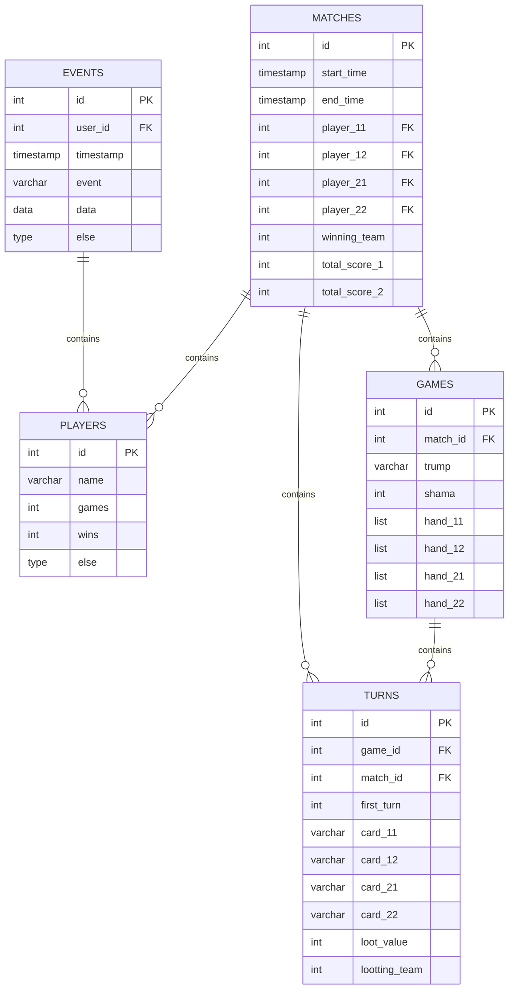

# Техническое задание: Карточная игра «Шама» на базе Telegram Mini App

## 1. Правила игры
Играются классические 36 игральных карт (карты: 6, 7, 8, 9, 10, валет, дама, король, туз и у каждой карты есть 4 масти: трефы, пики, черви, бубны, в итоге 4 x 9 = 36 карт). В игре принимает участие 2 команды по 2 игрока, игроки ходят фиксированно друг за другом по кругу, начало хода может начаться с любого игрока в зависимости от ситуации в игре (1.1 -> 2.1 -> 1.2 -> 2.2 или 2.2 -> 1.1 -> 2.1 -> 1.2). 

Самая старшая карта – это шесть трефы, дальше по убыванию – валет трефы, валет пики, валет черви, валет бубны, козырный туз, козырная десять, козырный король, козырная дама, козырная девять, козырная восемь, козырная семь, козырная шесть, туз, десять, король, дама, девять, восемь, семь, шесть. Козырем может быть любая масть, она объявляется в начале каждой раздачи. Пять карт всегда имеют статус козырной в независимости от объявленного козыря в текущей раздаче – это шесть трефы, валет трефы, валет пики, валет черви, валет бубны.

В начале игры всем случайно раздается по 9 карт. После раздачи, игрок у которого на руках шести трефы, должен объявить козырь, он сам выбирает, какая масть будет козырной в текущей раздаче. После объявления козыря этот игрок ходит первый и кидает любую карту из своей руки на стол. Остальные игроки должны в порядке очереди (противник, союзник, противник) выбросить по одной карте, но они должны бросать карты по следующим правилам:
1. Игроки обязаны кинуть карту такой же масти, с которой походил первый игрок, если такой масти у игрока нет, то он должен кинуть козырную карту, если козырной карты нет, то он должен кинуть любую карту из своей руки
2. Если первый игрок пошел с козырной карты, то и все остальные должны кидать козырные карты, если козырной карты нет, то можно кинуть любую карты из своей руки

После того, когда на столе оказывается 4 карты, то кон заканчивается и карты со стола (эти карты называют взяткой) забирает команда, чей участник кинул самую старшую карту. Игрок, чья карта была самой старшей, начинает следующий кон. Игра продолжаются до тех пор, пока у всех не закончатся карты на руках.

После завершения раздачи (у всех закончились карты) идет подсчет взяток команд.

Стоимость карт следующая:
1. туз – 11 очков
2. десять – 10 очков
3. король – 4 очка
4. дама – 3 очка
5. валет – 2 очка
6. все остальные карты – 0 очков

После подсчета взяток идет начисление очков:
- Для команды, у которой была шесть трефы на руках:
  - 0 взяток - 12 очков
  - меньше 30 взяток – 6 очков
  - меньше 60 взяток – 3 очка
  - ровно 60 взяток – 2 очка
- Для команды, у которой не было шесть трефы на руках:
  - 0 взяток - 6 очков
  - меньше 30 взяток – 3 очка
  - меньше 60 взяток – 1 очко

Игра идет до тех пор, пока какая-либо команда не наберет 12 очков и больше, команда, которая набрала 12 очков и больше, считается проигравшей.

Игрок может нарушать правила бросания карт, но если это заметит противник, то команде игрока начисляется 3 очка

## 2. Функции игры
### 2.1. Базовые функции
Необходимо обеспечить:
1. ознакомление с правилами игры
2. создание игры, добавление игроков в игру, запуск игры
3. раздача случайных карт из колоды, определение игрока с шамой и объявление козыря на текущую раздачу
4. начало игры
    1. ходы игроков в последовательности согласно правилам
        1. получение состояние игры
        1. вывод текущих карт игрока
        1. выбор игроком карты и выполнения хода (выкладывания карты на стол)
    1. заверешние хода - подсчет взятки и начисление их команде
    1. определение игрока, который начинает следующий ход
5. циклическое повторение с пункта 4.1
6. авто завершение раздачи, если у игроков закончились карты
    1. подсчет всех взяток
    2. распределние очков
7. циклическое повторение начало новой раздачи с пункта 3
8. авто завершение игры, если команда заработала 12 и более очков
9. объявление победителя и счет
### 2.2. CLI single-device
Реализации игры через интерфейс командной строки.

Помимо базовых функций, во время игры должны быть реализованы:
- вывод информации об игре перед тем, когда игрок должен выбрать карту для хода (какой счет по очкам, какой козырь и кто хвалил, номер хода, какие карты сейчас на столе, чей сейчас ход)
- очистка экрана после вывод карт на руках игроков, чтобы избежать расскрытия карт другому игроку и подтверждение от игрока для показа своих карт
- вывод результатов хода (кто забрал взятку и какой картой)
- вывод результатов раздачи (у кого сколько взяток, кому начисли и сколько начислили очков)

опционально:
- вывод статистики по игре (кто чаще всего хвалил, кто больше всего взяток забрал, кто больше всего отдал взяток противнику)

### 2.2. Телеграм бот
Реализации игры через сообщения с телеграм ботом.

Помимо базовых функций, во время игры должны быть реализованы:
- создание отдельной комнаты для игры, куда можно приглосить игроков по специальной инвайт ссылке
- для идентификации игроков использовать tg_chat_id и имя/логин
- удаление завершенных ходов игроков из сообщений
- всегда отображать информации об игре и карты игрока, но ограничивать возможности для хода, если сейчас не его ход
- вывод результатов хода (кто забрал взятку и какой картой)
- вывод результатов раздачи (у кого сколько взяток, кому начисли и сколько начислили очков)
- асинхронность, возможность корректно обрабатывать несколько одновременно действующих игр
- логирование всех действий игроков (создание игры, присоединение к игре, начало игры, начало раздачи, ходы игроков, завершение взяток, раздачи и самой игры и др.)
- хранение информации об игроках и их статистику (кол-во матчей, сколько раз хвалил козырь, сколько всего забрал взяток, сколько всего отдал взяток противнику и др.)

### 2.3. Телеграм WebApp
Реализации игры через WebApp с интеграцией в телеграм - полноценная игра с визуализацией

**TODO:** описать требования!!!

## 3. База данных
Для хранения логов, информации об игроке и достижений необходима интеграция с базой данных PostgreSQL

(схема может быть пересмотрена во время реализации)
#### Схема базы данных

## Система логирования
(система может быть пересмотрена во время реализации)
- **Matches**: Хранит данные матчей
- **Games**: Хранит данные раздач (9 кругов)
- **Turns**: Хранит данные ходов
- **Players**: Хранит данные игроков и их достежения
- **Events**: Хранит данные событий (регистрация, создание игры, подключение к игре и тд)