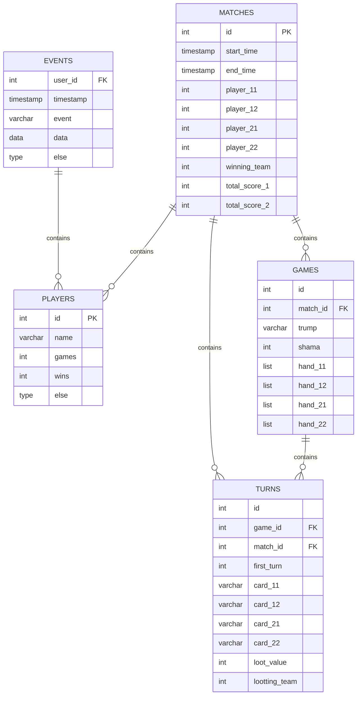

# Техническое задание: Карточная игра «Шама» на базе Telegram Mini App

## 1. Технические требования
### 1.1. Функционал
#### 1.1.1. Базовая механика
Играются классические 36 игральных карт (карты: 6, 7, 8, 9, 10, валет, дама, король, туз и у каждой карты есть 4 масти: крести, пики, черви, бубны, в итоге 4 x 9 = 36 карт). В игре принимает участие 2 команды по 2 игрока, игроки ходят фиксированно друг за другом по кругу, начало хода может начаться с любого игрока в зависимости от ситуации в игре (1.1 -> 2.1 -> 1.2 -> 2.2 или 2.2 -> 1.1 -> 2.1 -> 1.2). 

Самая старшая карта – это шесть крести, дальше по убыванию – валет крести, валет пики, валет черви, валет бубны, козырный туз, козырная десять, козырный король, козырная дама, козырная девять, козырная восемь, козырная семь, козырная шесть, туз, десять, король, дама, девять, восемь, семь, шесть. Козырем может быть любая масть, она объявляется в начале каждой раздачи. Пять карт всегда имеют статус козырной в независимости от объявленного козыря в текущей раздаче – это шесть крести, валет крести, валет пики, валет черви, валет бубны.

В начале игры всем случайно раздается по 9 карт. После раздачи, игрок у которого на руках шести крести, должен объявить козырь, он сам выбирает, какая масть будет козырной в текущей раздаче. После объявления козыря этот игрок ходит первый и кидает любую карту из своей руки на стол. Остальные игроки должны в порядке очереди (противник, союзник, противник) выбросить по одной карте, но они должны бросать карты по следующим правилам:
1. Игроки обязаны кинуть карту такой же масти, с которой походил первый игрок, если такой масти у игрока нет, то он должен кинуть козырную карту, если козырной карты нет, то он должен кинуть любую карту из своей руки
2. Если первый игрок пошел с козырной карты, то и все остальные должны кидать козырные карты, если козырной карты нет, то можно кинуть любую карты из своей руки

После того, когда на столе оказывается 4 карты, то кон заканчивается и карты со стола (эти карты называют взяткой) забирает команда, чей участник кинул самую старшую карту. Игрок, чья карта была самой старшей, начинает следующий кон. Хода продолжаются до тех пор, пока у всех не закончатся карты на руках.

После завершения раздачи (у всех закончились карты) идет подсчет взяток команд.

Стоимость карт следующая:
1. туз – 11 очков
2. десять – 10 очков
3. король – 4 очка
4. дама – 3 очка
5. валет – 2 очка
6. все остальные карты – 0 очков

После подсчета взяток идет начисление очков:
- Для команды, у которой была шесть крести на руках:
  - 0 взяток - 12 очков
  - меньше 30 взяток – 6 очков
  - меньше 60 взяток – 3 очка
  - ровно 60 взяток – 2 очка
- Для команды, у которой не было шесть крести на руках:
  - 0 взяток - 6 очков
  - меньше 30 взяток – 3 очка
  - меньше 60 взяток – 1 очко

Игра идет до тех пор, пока какая-либо команда не наберет 12 очков и больше, команда, которая набрала 12 очков и больше, считается проигравшей.

Игрок может нарушать правила бросания карт, но если это заметит противник, то команде игрока начисляется 3 очка

#### 1.1.2. Мультиплеер
У игры должен присутствовать мультиплеер по сети интернет

#### 1.1.3. Коммуникация
Игроки могут использовать текстовый чат и использовать реакции-эмодзи и короткие звуковые фразы

### 1.2. Дизайн-макеты
Для проекта будут использованы стандартные дизайн макеты карт и игрового стола из сети интернета

### 1.3. API Telegram
Для проекта будут использоваться WebApp, Payments, Telegram Bot

## 2. Инфраструктура
### 2.1. Бэкенд
Бэкенд будет размещаться на удаленном сервере с ОС Линукс

#### Архитектура: 
***(ядро) - (сервисный слой) - (интерфейсы)***
#### 1. Ядро - реализация всей логики игры
КЛАССЫ:
- GameState - Статус игры 
- GameProcess - Процесс игры 
- Card - Карта 
- Player - Игрок
##### 1.1. GameState
ПОЛЯ:
- Статус игры (код:)

        100 - игра создана
        101, 102, 103, 104 - кол-во игроков 1-4
        201 - карты раздались
        202 - установлен игрок с шамой
        203 - установлен козырь
        301, 302, 303, 304 - игрок 1-4 сделали ход
        401...409 - ход 1...9 закончен, взятка начислена
        500 - игра закончена, очки начислены
        600 - матч закончен, победитель определен
        700 - игра завершена
        1000 - ошибка

- Список игроков в игре
- Статус игры (набор игроков, ожидание старта, идет игра, пауза, игра завершена)
- Текущий счет
- Козырь
- Кто хвалил козырь (у кого шесть крести)
- Чей сайчас ход
- Карты на столе
##### 1.2. GameProcess
ФУНКЦИИ:
1. Создание игры
2. Добавление игроков
3. Запуск игры
4. Начало матча (раздача, у кого шама, какой козырь)
    1. Ходы игроков (заполнение стола, кто ходит следующий)
    2. Завершение ходов (подсчет взятоки, кому идет взятка, кто начинает следующий)
    3. Новый ход (если у игроков еще есть карты, то возвращаемся на 4.1.)
5. Окончание матча (подсчет всех взяток, начисление очков, если нет команды с 12 и более очками, то возвращаемся на 4.)
6. Завершение игры
##### 1.3. Card 
ПОЛЯ:
- Масть
- Значение
- Ценность
##### 1.4. Player
ПОЛЯ:
- ИД игрока
- Имя игрока (логин)
- Карты на руке у игрока
- Доп поля для информации об игроке(привелегии и тд.)
##### 1.5. Логика
GameState - состояние ядра/матчей/игры ???

#### 2. Сервисный слой - API для управления ядром игры
Возвращает информацию об игре
#### 3. Интерфейсы
- CLI
- Telegram Bot
- Telegram WebApp

### 2.2. База данных
Для хранения логов, информации об игроке и достижений необходима интеграция с базой данных PostgreSQL
#### Схема базы данных

## 3. Технологический стек
### 3.1. Фронтенд
Фреймворк React

### 3.2. Бэкенд
Python

## 4. Монетизация
В игре должны присутствовать внутриигровые покупки на базе Telegram Payments

## 5. Дополнительно
Для проекта уже есть созданный телеграм бот, регистрация, запуск игры и внутриигровые покупки должны совершаться через телеграм бот. Для покупки будут доступны реакции-эмодзи и короткие звуковые фразы
