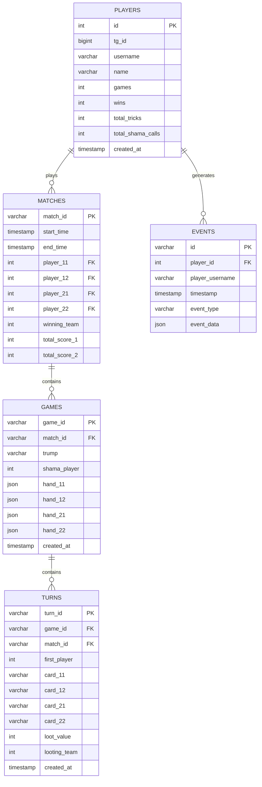

# Техническое задание: Карточная игра «Шама»

## 1. Правила игры

Играются классические 36 игральных карт (6, 7, 8, 9, 10, валет, дама, король, туз × 4 масти = 36 карт). В игре участвуют 2 команды по 2 игрока. Порядок ходов фиксированный и цикличный: `1.1 → 2.1 → 1.2 → 2.2 → 1.1 → …`. Начальный игрок хода определяется ситуацией в игре.

**Иерархия карт (от сильнейшей к слабейшей):**
`6♣ > J♣ > J♠ > J♥ > J♦ > козырный A > козырная 10 > козырный K > козырная Q > козырная 9 > козырная 8 > козырная 7 > козырная 6 > A > 10 > K > Q > 9 > 8 > 7 > 6`

Козырем может быть любая масть — объявляется в начале каждой раздачи. Пять карт всегда являются козырными независимо от объявленной масти: `6♣, J♣, J♠, J♥, J♦`.

### Начало раздачи
Всем раздаётся по 9 карт. Игрок с `6♣` (шамой) объявляет козырь и ходит первым.

### Правила хода
1. Нужно ходить в масть первой карты кона.
2. Нет масти → нужно сыграть козырем.
3. Нет козыря → любая карта.
4. Если первый ход козырем → все обязаны ходить козырем (при наличии).

### Завершение кона
После 4 карт на столе взятку забирает команда с самой сильной картой. Этот игрок начинает следующий кон.

### Стоимость карт
| Карта | Очки |
|---|---|
| Туз | 11 |
| Десятка | 10 |
| Король | 4 |
| Дама | 3 |
| Валет | 2 |
| Остальные | 0 |

### Начисление очков за раздачу
**Команда с шамой (`6♣`):**
| Взятки | Очки |
|---|---|
| 0 | 12 |
| < 30 | 6 |
| < 60 | 3 |
| = 60 | 2 |

**Команда без шамы:**
| Взятки | Очки |
|---|---|
| 0 | 6 |
| < 30 | 3 |
| < 60 | 1 |

Матч идёт до набора одной из команд **12 и более очков** — эта команда проигрывает.

Нарушение правил хода можно оспорить: команде нарушителя начисляется 3 очка.

---

## 2. Клиенты

### 2.1. CLI (`client_cli/start_game.py`) ✅

Локальная игра для 4 игроков за одним устройством.

**Реализовано:**
- Ввод имён игроков
- Очистка экрана перед показом карт (конфиденциальность)
- Отображение состояния: счёт, козырь, кто хвалил, номер хода, карты на столе
- Выбор козыря и карты по номеру
- Вывод результата кона (кто забрал, какой картой, сколько очков)
- Вывод результата раздачи и победителя матча
- Перераздача по запросу игрока

**Запуск:**
```bash
cd backend
python -m client_cli.start_game
```

### 2.2. Telegram-бот (`client_tg_bot/`) ✅

Онлайн-игра для 4 игроков через личные сообщения бота.

**Модули:**
| Файл | Роль |
|---|---|
| `start_game.py` | Точка входа: `run_bot()`, `main()` |
| `state.py` | Глобальное in-memory состояние (словари матчей, движков, привязок игроков) |
| `game.py` | Игровые хелперы: `start_game()`, `send_player_cards()`, `send_message_to_all_players()` |
| `handlers.py` | Все обработчики команд (`/start`, `/create_game`, …) и callback-кнопок |

**Реализовано:**
- Создание игровой комнаты (`/create_game`) и инвайт-ссылка
- Присоединение по ссылке, выбор команды через кнопки
- Автостарт при 4 игроках
- Отправка карт каждому игроку в личку
- Выбор козыря и ходы картами через инлайн-кнопки
- Результаты кона, раздачи и матча — всем игрокам
- Поддержка нескольких одновременных игр (in-memory)
- Сохранение статистики игроков (игры, победы, взятки, шама-ходы)
- Логирование событий (JSON-файлы)
- Команды: `/status`, `/stats`, `/rules`, `/help`, `/ping`, `/info`

**Не реализовано (в планах):**
- Восстановление игр после рестарта бота
- Полное логирование раздач и ходов в хранилище
- Команда `/leave_game`

**Запуск:**
```bash
cd backend
python -m client_tg_bot.start_game
```

### 2.3. Telegram WebApp (`client_web/start_game.py`) 🚧

Визуальная игра с интерфейсом внутри Telegram. **В разработке, требования уточняются.**

---

## 3. Архитектура

### Слоёная структура

```
Клиенты (client_cli / client_tg_bot / client_web)
                    ↓
             bin/core.py       ← GameEngine, MatchState, Player, Card
             bin/constants.py  ← GameConstants (статусы, масти, очерёдность)
                    ↓
    bin/storage_factory.py → bin/file_storage.py
                           → bin/database_manager.py
```

### Состояния игры (`GameConstants.Status`)

| Значение | Смысл |
|---|---|
| `WAITING_PLAYERS` (100) | Ожидание регистрации игроков |
| `PLAYERS_ADDED` (104) | Все 4 игрока добавлены |
| `CARDS_DEALT` (201) | Карты розданы |
| `WAITING_TRUMP` (202) | Ожидание выбора козыря |
| `TRUMP_SELECTED` (203) | Козырь выбран, игра идёт |
| `PLAYING_CARDS` (300) | Открыт новый кон |
| `PLAYED_CARD_1..3` (301–303) | 1–3 карты на столе |
| `TRICK_COMPLETED` (304) | 4 карты, кон завершён |
| `GAME_COMPLETED` (409) | Все 9 конов сыграны |
| `NEW_DEAL_READY` (500) | Готово к новой раздаче |
| `MATCH_COMPLETED` (600) | Матч завершён (12+ очков) |
| `GAME_FINISHED` (700) | Игра полностью завершена |

### Идентификаторы игроков и команд

| Константа | Значение |
|---|---|
| `PLAYER_1_1` / `PLAYER_1_2` | 11 / 12 |
| `PLAYER_2_1` / `PLAYER_2_2` | 21 / 22 |
| `TEAM_1` / `TEAM_2` | 10 / 20 |

Порядок ходов: `11 → 21 → 12 → 22 → 11 → …`

---

## 4. Хранилище данных

### 4.1. Файловое хранилище (по умолчанию)

Данные в директории `backend/storage/`:

| Файл | Колонки |
|---|---|
| `players/players.csv` | id, username, name, games, wins, total_tricks, total_shama_calls, created_at |
| `matches/matches.csv` | match_id, start_time, end_time, player_11..22, winning_team, total_score_1, total_score_2 |
| `games/games.csv` | match_id, game_id, trump, shama_player, hand_11..22 (JSON), created_at |
| `turns/turns.csv` | match_id, game_id, turn_id, first_player, card_11..22, loot_value, looting_team, created_at |
| `events/*.json` | id, player_id, player_username, timestamp, event_type, event_data |

Переменная окружения: `STORAGE_TYPE=file` (умолчание).

### 4.2. PostgreSQL (опционально)

Схема идентична файловой. Переменная окружения: `STORAGE_TYPE=postgres`.

Дополнительные переменные: `DB_HOST`, `DB_PORT`, `DB_NAME`, `DB_USER`, `DB_PASSWORD`.


```mermaid
erDiagram
    PLAYERS ||--o{ MATCHES : plays
    MATCHES ||--o{ GAMES : contains
    GAMES ||--o{ TURNS : contains
    PLAYERS ||--o{ EVENTS : generates

    PLAYERS {
        int id PK
        bigint tg_id
        varchar username
        varchar name
        int games
        int wins
        int total_tricks
        int total_shama_calls
        timestamp created_at
    }
    MATCHES {
        varchar match_id PK
        timestamp start_time
        timestamp end_time
        int player_11 FK
        int player_12 FK
        int player_21 FK
        int player_22 FK
        int winning_team
        int total_score_1
        int total_score_2
    }
    GAMES {
        varchar game_id PK
        varchar match_id FK
        varchar trump
        int shama_player
        json hand_11
        json hand_12
        json hand_21
        json hand_22
        timestamp created_at
    }
    TURNS {
        varchar turn_id PK
        varchar game_id FK
        varchar match_id FK
        int first_player
        varchar card_11
        varchar card_12
        varchar card_21
        varchar card_22
        int loot_value
        int looting_team
        timestamp created_at
    }
    EVENTS {
        varchar id PK
        int player_id FK
        varchar player_username
        timestamp timestamp
        varchar event_type
        json event_data
    }
```

---

## 5. Тестирование

```bash
cd backend
pytest tests/          # все тесты
pytest tests/ -v       # подробный вывод
```

| Файл | Покрытие |
|---|---|
| `tests/test_core.py` | Card, Player, MatchState, GameEngine (53 теста) |
| `tests/test_game_cli.py` | Функции CLI-клиента |
