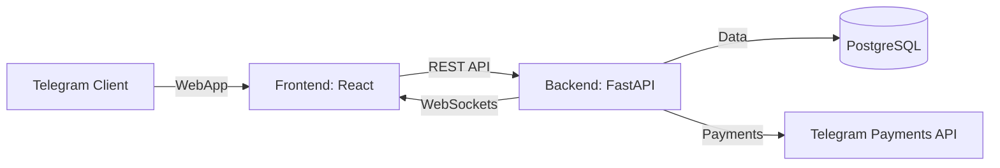
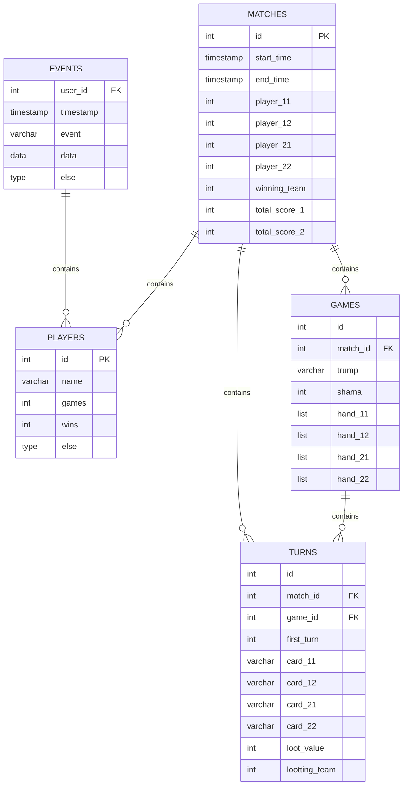

# План разработки игры "Шама"

## Обзор проекта
- Карточная игра "Шама" для 4 игроков (2 команды по 2 игрока)
- Особенности игры:
  - Используется колода из 36 карт
  - Игра ведется на 9 кругов (раздач)
  - Командная стратегия и тактика
  - Специальные правила подсчета очков
- Интеграция с Telegram через WebApp
- Мультиплеерная онлайн-игра
- Система логирования и статистики

## Архитектура системы

## Этапы разработки

### 1. Игровое ядро (5 дней)
- Реализация логики карт и ходов по правилам "Шамы"
- CLI-интерфейс для тестирования
- Юнит-тесты

### 2. Фронтенд (3 дня)
- Адаптивный интерфейс для мобильных устройств
- Базовые компоненты игры (игровой стол, карты игрока)

### 3. Telegram интеграция (2 дня)
- WebApp для single-device игры
- Базовое взаимодействие с ботом

### 4. База данных (4 дня)
- Настройка PostgreSQL
- Система логирования матчей и раздач

### 5. Мультиплеер (5 дней)
- WebSockets для реального времени
- Система комнат и приглашений
- Рейтинговая система

## Схема базы данных

## Система логирования
- **MatchesLog**: Хранит данные матчей
- **GamesLog**: Хранит данные раздач (9 кругов)
- **TurnsLog**: Хранит данные ходов
- **PlayersLog**: Хранит данные игроков
- **EventsLog**: Хранит данные событий (регистрация, создание игры, подключение к игре и тд)

## Необходимые ресурсы
1. Сервер PostgreSQL
2. Python 3.10+ для бэкенда
3. Node.js 18+ для фронтенда
4. Telegram Bot API

---
_План актуален на 23 июня 2025 г._
